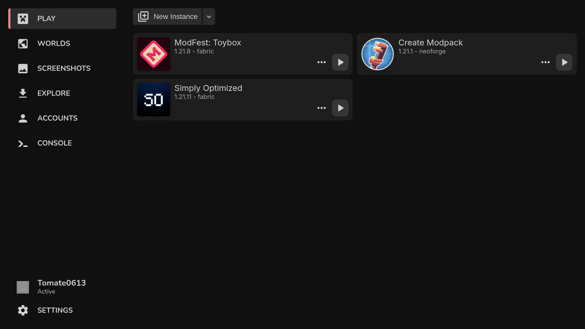
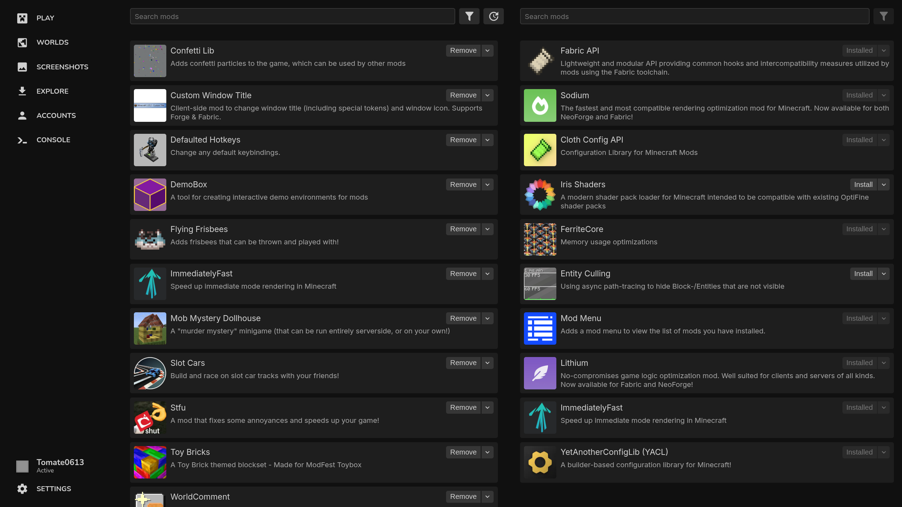
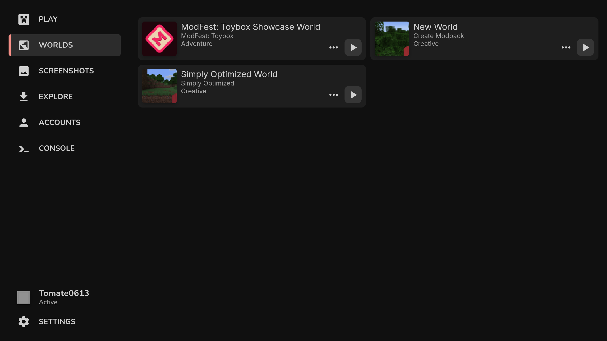

# Tomate Launcher



## Features
### Side-by-Side mod, resourcepack and shaderpack management


### Quicklaunch


### File Deduplication
Deduplicate mods, resourcepacks and shaderpacks to save space by hardlinking the files.
If a file has already been downloaded this makes adding it extremely fast

## Development
### Setup
- Install pnpm
- `pnpm i`


`pnpm dev` to start

### NixOS
There is a dev shell available in the flake. Requires
```nix
programs.nix-ld.enable = true;
```

### Packages
Code is split up over multiple packages / repos
- [Launcher Core](https://github.com/Tomate0613/launcher-core) handles launching the game
- [Tomate Mods](https://github.com/Tomate0613/tomate-mods) for interactions with curseforge and modrinth api
- [Find Java](https://github.com/Tomate0613/find-java) for finding java installations
- [Tomate Loaders](https://github.com/Tomate0613/tomate-loaders) handles fetching mod loader metadata
